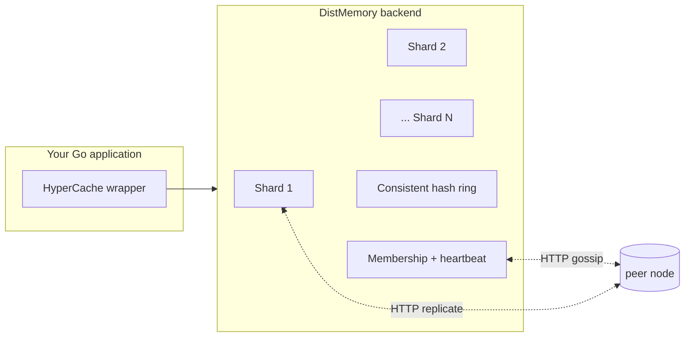

# HyperCache

Distributed in-memory cache for Go. Sharded for concurrency, replicated for durability under partial failure,
observable from the start, and shipped as both a library and a single-binary HTTP service.

- :material-rocket-launch: **[Quickstart](quickstart.md)** — five minutes from `go get` to a working cache.
- :material-server-network: **[5-Node Cluster](cluster.md)** — boot a real cluster with `docker compose`.
- :fontawesome-brands-kubernetes: **[Helm Chart](helm.md)** — deploy on Kubernetes with stable identities.
- :material-tools: **[Operations Runbook](operations.md)** — split-brain, hint queues, drain, capacity.
- :material-bell-alert: **[On-call Cheatsheet](oncall.md)** — symptom → log grep → metric → action for paged
  operators.

## Why HyperCache

|                         | What you get                                                              | Why it matters                                                    |
| ----------------------- | ------------------------------------------------------------------------- | ----------------------------------------------------------------- |
| **Sharded by default**  | 32 per-shard mutexes routed by xxhash                                     | Write throughput scales with cores, no global lock.               |
| **Distributed backend** | Consistent hashing, configurable replication, quorum reads/writes         | A single failed node does not lose keys.                          |
| **Hinted handoff**      | Failed forwards queue with TTL, replay on the dist HTTP transport         | Transient peer outages don't drop replicas.                       |
| **SWIM heartbeat**      | Direct + indirect probes; self-refute via incarnation gossip              | Filters caller-side network blips, recovers from false suspicion. |
| **Observable**          | `slog` logger + OpenTelemetry tracing + OpenTelemetry metrics, all opt-in | Plug into your existing pipeline, no extra deps.                  |
| **Operator-friendly**   | `Drain` endpoint, cursor-paged key enumeration, JSON error envelopes      | Designed for rolling deploys and on-call clarity.                 |

## How it fits together

The `HyperCache` wrapper is a thin facade you embed in your application. The `DistMemory` backend handles
sharding, replication, and the cluster plane. Two HTTP listeners run per process: a peer-to-peer one for
replication and gossip, and a separate management one for admin and observability.

## Two ways to use it

**As a library** — embed `HyperCache` directly in your Go application; it uses the in-memory or distributed
backend in-process. See [Quickstart](quickstart.md).

**As a service** — run the [`hypercache-server`](server.md) binary; clients talk to it over a REST API. See
[5-Node Cluster](cluster.md) for the docker-compose recipe and [Helm Chart](helm.md) for Kubernetes.

## Project status

The distributed backend is production-ready as of v0.6.0 — see the [changelog](changelog.md) for the full list
of features and fixes that landed during the productionization push (Phases A through E in the upstream
history). Operations procedures live in the [runbook](operations.md).
